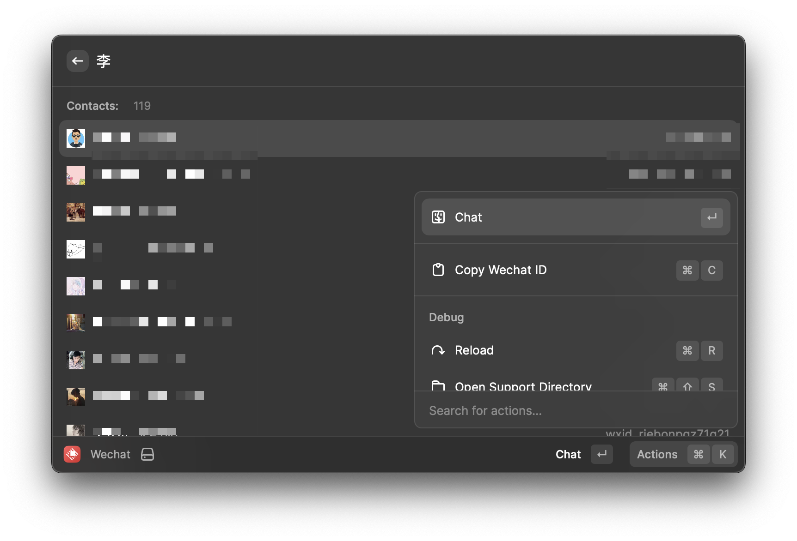

# Wechat

A RayCast extension for WeChat to quickly search your contacts and chat

## Requirement

Install [WeChatTweak-macOS](https://github.com/Sunnyyoung/WeChatTweak-macOS) first

`brew install sunnyyoung/repo/wechattweak-cli`

`sudo wechattweak-cli install`

## Todo

- [x] Search Contact
- [x] Open Contact
- [x] List Wechat ID
- [x] Copy Wechat ID
- [x] Display Avatar
- [ ] Fix bug
- [ ] Upload to Raycast Store

## How to Use

before I create the final version and release it to Raycast Store,
you can build it with your own
`npm install && npm run dev`

## Known Issue

When you open a contact conversation, the system will automatically open the browserhow to disable open in browser.

## License

MIT
